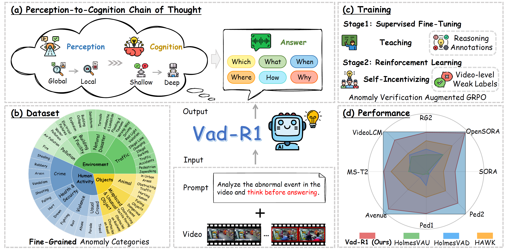

# Vad-R1

[📑paper](https://arxiv.org/abs/2505.19877) 

Official repositories for "Vad-R1: Towards Video Anomaly Reasoning via Perception-to-Cognition Chain-of-Thought".

## 📢 Hightlights
* We propose Vad-R1, a novel end-to-end MLLM-based framework tailored for VAR, which aims at further analysis and understanding of anomalies in the video.
* We design a structured Perception-to-Cognition Chain-of-Thought, and construct Vad-Reasoning, a specially designed dataset for video anomaly reasoning with two subsets. Besides, we propose an improved reinforcement learning algorithm AVA-GRPO, which incentivizes the reasoning capability of MLLMs through a self verification way.
* The experimental results show that the proposed Vad-R1 achieves superior performance across multiple evaluation scenarios, surpassing both open-source and proprietary models in video anomaly detection and reasoning tasks.

## 🔥 News
* [2025/06/15] 🔥 Our datasets are avaibile on 🤗Huggingface!
* [2025/05/27] 🔥 Our paper is avaibile on Arxiv!
## 📊 Data instruction
