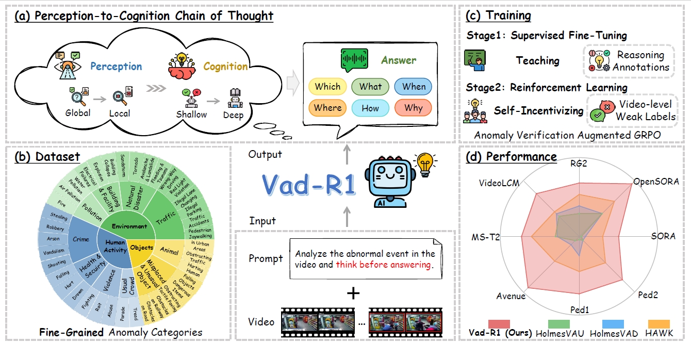

# Vad-R1

 

Official repositories for "Vad-R1: Towards Video Anomaly Reasoning via Perception-to-Cognition Chain-of-Thought".

## 📢 Hightlights
* We propose Vad-R1, a novel end-to-end MLLM-based framework tailored for VAR, which aims at further analysis and understanding of anomalies in the video.
* We design a structured Perception-to-Cognition Chain-of-Thought, and construct Vad-Reasoning, a specially designed dataset for video anomaly reasoning with two subsets. Besides, we propose an improved reinforcement learning algorithm AVA-GRPO, which incentivizes the reasoning capability of MLLMs through a self verification way.
* The experimental results show that the proposed Vad-R1 achieves superior performance across multiple evaluation scenarios, surpassing both open-source and proprietary models in video anomaly detection and reasoning tasks.

## 🔥 News
* `2025/06/15` 🔥 Our datasets are avaibile on [🤗Huggingface](https://huggingface.co/datasets/wbfwonderful/Vad-R1/tree/main)!
* `2025/05/27` 🔥 Our paper is avaibile on [Arxiv](https://arxiv.org/abs/2505.19877)!
## 📊 Data instruction
Our Vad-Reasoning Dataset is split into two subsets: Vad-Reasoning-SFT which contains 1755 videos annotated with high-quality reasoning process, and Vad-Reasoning-RL which contains 6448 videos with video-level weak labels.

Our datasets are avaibile on [🤗Huggingface](https://huggingface.co/datasets/wbfwonderful/Vad-R1/tree/main). Each row of `Vad-Reasoning-SFT-train.jsonl` and `Vad-Reasoning-SFT-test.jsonl` contains:
* `source` : The video source. (e.g. "UCF" means the video is collected form UCF-Crime dataset.)
* `video` : The video name.
* `anomaly_type` : The specific anomaly type of the video.
* `path` : The path of the video.
* `total_frames` : The total frames of the video.
* `think` & `answer` : The reasoning process and the final answer of the video.
* `start` & `end` : The time range of the anomaly event in the video (only for abnormal videos).

Each row of `Vad-Reasoning-RL.jsonl` only contains the video-level weak label ("Abnormal" or "Normal").
